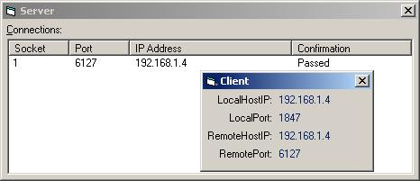



## Connect Client to Server without either knowing the others IP \(v2\)

### Description

This is two applications; a client and a server application. It uses a combination of UDP broadcast packets and TCP client/server protocol to connect. The client sends a broadcast packet every second and the server catches it and replies with the server IP. The client can then connect to the server over TCP.
 
### More Info
 

             |
---                |---
**Submitted On**   |2005-06-05 16:51:04
**By**             |[SubOne](https://github.com/Planet-Source-Code/PSCIndex/blob/master/ByAuthor/subone.md)
**Level**          |Beginner
**User Rating**    |5.0 (25 globes from 5 users)
**Compatibility**  |VB 3\.0, VB 4\.0 \(16\-bit\), VB 4\.0 \(32\-bit\), VB 5\.0, VB 6\.0
**Category**       |[Internet/ HTML](https://github.com/Planet-Source-Code/PSCIndex/blob/master/ByCategory/internet-html__1-34.md)
**World**          |[Visual Basic](https://github.com/Planet-Source-Code/PSCIndex/blob/master/ByWorld/visual-basic.md)
**Archive File**   |[Connect\_Cl189751652005\.zip](https://github.com/Planet-Source-Code/subone-connect-client-to-server-without-either-knowing-the-others-ip-v2__1-60934/archive/master.zip)

